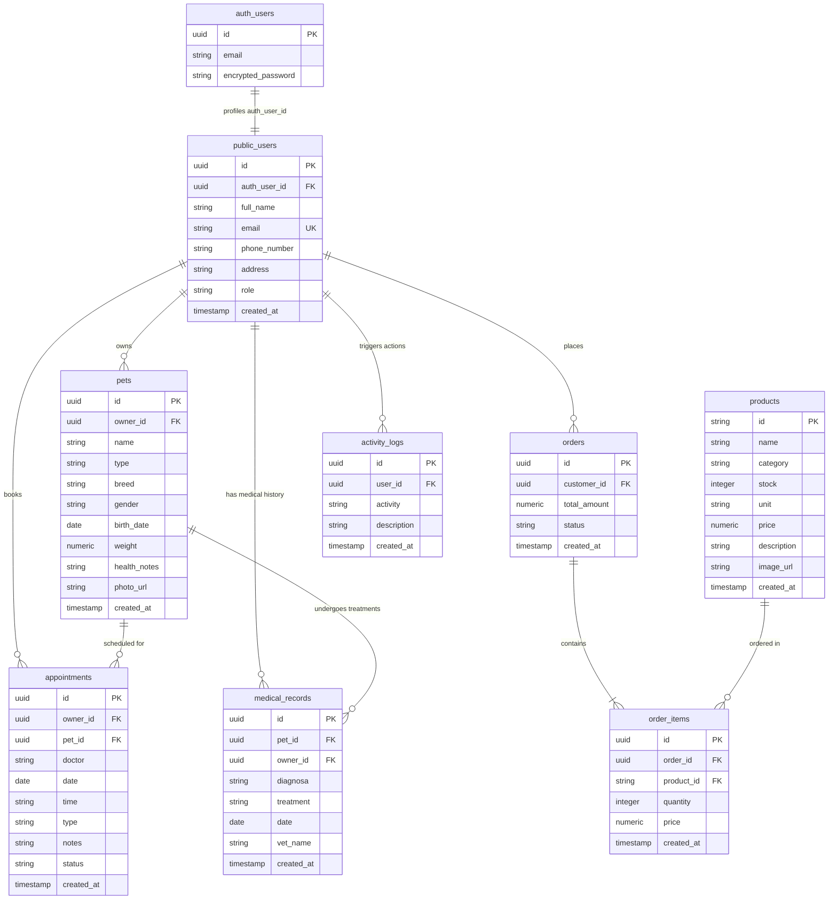

# 🐾 CRM PetCare & Customer Portal - Dokumentasi Lengkap Sistem

Dokumentasi lengkap mengenai arsitektur sistem, struktur proyek, skema database relasional, kebijakan keamanan (RLS), alur otentikasi, dan tata cara instalasi untuk aplikasi **CRM PetCare & Customer Portal**.

---

## 📌 Daftar Isi
1. [Arsitektur Database & Relasi](#-1-arsitektur-database--relasi)
2. [Keamanan & Row Level Security (RLS)](#-2-keamanan--row-level-security-rls)
3. [Struktur Direktori Proyek](#-3-struktur-direktori-proyek)
4. [Peran Pengguna (Role Matrix)](#-4-peran-pengguna-role-matrix)
5. [Logika & Mekanisme Unggulan](#-5-logika--mekanisme-unggulan)
6. [Panduan Instalasi & Penggunaan](#-6-panduan-instalasi--penggunaan)

---

## 📊 1. Arsitektur Database & Relasi

Sistem ini didukung oleh **Supabase (PostgreSQL)** sebagai basis data relasional real-time. Hubungan antar tabel dirancang secara terintegrasi menggunakan integritas referensial (`FOREIGN KEY`) dan cascade delete.

### Diagram Relasi Tabel (ERD)



### Detail Struktur Kolom

1. **`public.users` (Profil Pengguna)**
   - `id`: UUID (Primary Key, default random).
   - `auth_user_id`: UUID (Menghubungkan ke `auth.users(id)` Supabase Auth, Relasi 1:1, `ON DELETE CASCADE`).
   - `full_name`: Text (Nama Lengkap).
   - `email`: Text (Unik, sinkron dengan akun Auth).
   - `phone_number`: Text (Nomor Telepon).
   - `address`: Text (Alamat Lengkap).
   - `role`: Text (Tipe akun: `'admin'`, `'staff'`, atau `'customer'`).

2. **`public.pets` (Hewan Peliharaan)**
   - `id`: UUID (Primary Key).
   - `owner_id`: UUID (Menghubungkan ke `public.users(auth_user_id)`).
   - `name`: Text (Nama Hewan).
   - `type`: Text (Jenis Hewan, cth: `'Cat'`, `'Dog'`, `'Rabbit'`).
   - `breed`: Text (Ras, default `'Campuran'`).
   - `gender`: Text (Jenis Kelamin: `'Jantan'` / `'Betina'`).
   - `birth_date`: Date (Tanggal Lahir).
   - `weight`: Numeric (Berat Badan dalam kg).
   - `health_notes`: Text (Riwayat kesehatan awal/alergi).

3. **`public.appointments` (Janji Temu / Booking)**
   - `id`: UUID (Primary Key).
   - `owner_id`: UUID (Menghubungkan ke `public.users(auth_user_id)`).
   - `pet_id`: UUID (Menghubungkan ke `public.pets(id)`).
   - `doctor`: Text (Dokter Hewan yang menangani).
   - `date`: Date (Tanggal Janji).
   - `time`: Text (Jam Janji, cth: `'09:00'`, `'13:30'`).
   - `type`: Text (Jenis Layanan, cth: `'Konsultasi Dokter'`, `'Vaksinasi'`, `'Grooming'`).
   - `notes`: Text (Keluhan/Catatan Tambahan).
   - `status`: Text (Status janji: `'Pending'`, `'Confirmed'`, `'Completed'`, `'Cancelled'`).

4. **`public.products` (Katalog Apotek/Toko)**
   - `id`: Text (Primary Key, kode SKU cth: `'INV-01'`, `'INV-02'`).
   - `name`: Text (Nama Produk).
   - `category`: Text (Kategori: `'Obat'`, `'Makanan'`, `'Alat Medis'`, `'Aksesoris'`).
   - `stock`: Integer (Stok Tersedia).
   - `unit`: Text (Satuan produk: `'Vial'`, `'Botol'`, `'Tablet'`, `'Pouch'`, `'Pcs'`).
   - `price`: Numeric (Harga Jual).
   - `description`: Text (Keterangan/Indikasi/Petunjuk penyimpanan).

5. **`public.orders` & `public.order_items` (Transaksi & Item Belanja)**
   - **Orders**:
     - `id`: UUID (Primary Key).
     - `customer_id`: UUID (Menghubungkan ke `public.users(auth_user_id)`).
     - `total_amount`: Numeric (Total Belanja).
     - `status`: Text (Status: `'Pending'`, `'Paid'`, `'Processing'`, `'Completed'`, `'Cancelled'`).
   - **Order Items**:
     - `id`: UUID (Primary Key).
     - `order_id`: UUID (Menghubungkan ke `public.orders(id)`).
     - `product_id`: Text (Menghubungkan ke `public.products(id)`).
     - `quantity`: Integer (Jumlah Beli, minimal 1).
     - `price`: Numeric (Harga per unit saat pembelian).

6. **`public.medical_records` (Rekam Medis)**
   - `id`: UUID (Primary Key).
   - `pet_id`: UUID (Menghubungkan ke `public.pets(id)`).
   - `owner_id`: UUID (Menghubungkan ke `public.users(auth_user_id)`).
   - `diagnosa`: Text (Hasil Diagnosa Penyakit).
   - `treatment`: Text (Tindakan/Resep Obat).
   - `date`: Date (Tanggal Pemeriksaan).
   - `vet_name`: Text (Nama Dokter Pemeriksa).

7. **`public.activity_logs` (Log Aktivitas Pengguna)**
   - `id`: UUID (Primary Key).
   - `user_id`: UUID (Menghubungkan ke `public.users(auth_user_id)`).
   - `activity`: Text (Aktivitas cth: `'Customer Membeli Produk'`).
   - `description`: Text (Deskripsi rinci mengenai log tersebut).

---

## 🔑 2. Keamanan & Row Level Security (RLS)

Seluruh tabel publik mengaktifkan **Row Level Security (RLS)** untuk mengisolasi data antar pengguna secara aman.

* **Tabel `public.users`**:
  - Semua pengguna dapat membuat data saat registrasi (`INSERT`).
  - Pengguna hanya dapat membaca (`SELECT`) dan mengubah (`UPDATE`) profil mereka sendiri.
  - Admin/Staff dapat melihat semua profil pengguna untuk monitoring CRM.
* **Tabel `public.pets` & `public.appointments`**:
  - Customer hanya bisa melakukan operasi data (CRU) pada hewan/janji temu milik sendiri (`auth.uid() = owner_id`).
  - Admin dan Staff memiliki akses baca & tulis penuh.
* **Tabel `public.products`**:
  - Semua pengunjung (guest & logged-in) memiliki akses baca (`SELECT`) untuk menampilkan apotek.
  - Hanya Admin/Staff yang memiliki hak penuh (CRUD) untuk manajemen stok/katalog.
* **Tabel `public.orders` & `public.order_items`**:
  - Customer hanya dapat memesan atas nama dirinya (`auth.uid() = customer_id`) dan melihat riwayat belanja mereka sendiri.
  - Staff & Admin dapat mengelola pemesanan untuk merubah status pengiriman/pembayaran.
* **Tabel `public.medical_records`**:
  - Customer hanya dapat membaca (`SELECT`) rekam medis milik hewannya sendiri (`auth.uid() = owner_id`).
  - Dokter (Admin/Staff) dapat mengelola rekam medis hewan peliharaan secara penuh.

---

## 📁 3. Struktur Direktori Proyek

```text
project-react/
├── src/
│   ├── components/
│   │   ├── ui/                 # Komponen dasar Shadcn UI (Table, Input, Button, dll.)
│   │   ├── ActivityTimeline.jsx# [New] Komponen timeline aktivitas dengan visualisasi status
│   │   ├── DataRow.jsx         # [New] Baris data grid modular dengan hover transitions
│   │   ├── ErrorBoundary.jsx   # Penangkap error runtime React (mencegah layar putih)
│   │   ├── HeroStat.jsx        # [New] Kartu stat glassmorphic mini dengan glow effects
│   │   ├── MetricCard.jsx      # [New] Kartu metrik modular bertema dengan icon indikator
│   │   ├── ProtectedRoute.jsx  # Guard route berbasis status Auth & verifikasi Role
│   │   ├── SectionCard.jsx     # [New] Kontainer card modular berkelas untuk membungkus konten
│   │   └── Sidebar.jsx         # Navigasi samping dinamis menyesuaikan tipe Role
│   ├── context/
│   │   └── AuthContext.jsx     # State manager otentikasi & manajemen sesi profil
│   ├── lib/
│   │   └── supabase.js         # Inisialisasi Supabase Client
│   ├── pages/
│   │   ├── auth/
│   │   │   ├── Login.jsx       # Halaman Masuk Akun (beserta verifikasi email)
│   │   │   └── Register.jsx    # Pendaftaran Customer Baru (menggunakan upsert aman)
│   │   ├── AddPet.jsx          # Registrasi pet dengan owner email validator
│   │   ├── Appointments.jsx    # Manajemen Janji Temu (Booking & Status Updater)
│   │   ├── CustomerCrm.jsx     # [Admin] Monitoring Customer CRM & statistik agregat
│   │   ├── CustomerCrmDetail.jsx# [Admin] Detail profil, transaksi, aktivitas, & timeline customer
│   │   ├── Dashboard.jsx       # Dashboard ganda (Statistik Admin vs Portal Customer)
│   │   ├── LandingPage.jsx     # Landing Page publik yang terhubung ke Form Booking & Apotek Cepat
│   │   ├── MedicalRecords.jsx  # Riwayat medis hewan (Tampilan Ringkas / Detail)
│   │   ├── Orders.jsx          # [Customer] Pelacakan transaksi & pesanan apotek
│   │   ├── PetOwners.jsx       # [Admin] Daftar Pemilik Hewan & data relasional
│   │   ├── PetOwnersDetail.jsx # [Admin] Detail pemilik, tren kunjungan, & timeline janji temu
│   │   ├── Pets.jsx            # Daftar hewan dengan visualisasi kartu emoji & statistik
│   │   ├── PetsDetail.jsx      # Detail rekam medis, skor perawatan, & grafik nilai anabul
│   │   ├── Shop.jsx            # [Customer] Toko Obat & Apotek Online (Keranjang & Checkout)
│   │   └── Profile.jsx         # Pengaturan profil pengguna
│   ├── App.jsx                 # Registrasi Routing Halaman & Error Boundary Wrapper
│   ├── main.jsx                # Entry point aplikasi React
│   └── index.css               # Desain global & Tailwind CSS setup
├── supabase_complete_schema.sql# Skema DDL Database lengkap beserta RLS Policies
├── seed_50_records.sql         # Query seeding data (minimal 50 data per tabel)
├── package.json                # Dependensi proyek (React, Tailwind, Recharts, Supabase, dll.)
└── vite.config.js              # Konfigurasi build Vite
```

---

## 🧑‍💻 4. Peran Pengguna (Role Matrix)

Aplikasi memiliki manajemen hak akses berbasis role:

| Fitur / Halaman | Admin | Staff | Customer | Guest (Non-Login) |
| :--- | :---: | :---: | :---: | :---: |
| **Dashboard** | View Admin Stats | View Admin Stats | View Customer Stats | Redirection ke Login |
| **Manajemen User** | Full Access (CRUD) | No Access | No Access | No Access |
| **Customer CRM** | Full Access | Full Access | No Access | No Access |
| **Add Pet (Hewan)** | Semua Owner Email | Semua Owner Email | Hanya Dirinya Sendiri | No Access |
| **Toko Obat & Apotek** | Kelola Stok (CRUD) | Kelola Stok (CRUD) | Beli & Checkout | Hanya Lihat Katalog |
| **Jadwal Janji Temu** | Kelola Status (CRUD) | Kelola Status (CRUD) | Booking & Batal | Form Landing Page |
| **Rekam Medis** | Full Access (CRUD) | Full Access (CRUD) | Hanya Lihat (Read-only) | No Access |
| **Log Aktivitas** | Baca Semua | No Access | No Access | No Access |

---

## ⚙️ 5. Logika & Mekanisme Unggulan

### 🛡️ Self-Healing Profiles
Sistem memiliki mekanisme pemulihan profil mandiri di `AuthContext.jsx`. Jika pengguna terdaftar di Supabase Auth (misal sesi browser masih tersimpan di `localStorage`) namun profil publik mereka di tabel `public.users` tidak ditemukan (akibat database di-migrasi/direset), sistem secara otomatis meng-upsert profil baru secara instan begitu sesi terdeteksi agar sesi navigasi tidak rusak atau crash.

### 🔗 Relational Join Fallbacks
PostgREST pada Supabase tidak dapat melakukan join relasional lintas skema (seperti antara skema `public` dengan skema `auth.users`). Untuk menjaga performa, halaman **Pets**, **Appointments**, dan **Medical Records** dilengkapi logika fallback:
- Jika join query langsung gagal karena relasi skema, sistem secara otomatis menjalankan query terpisah ke tabel target lalu memetakan nama pemilik secara dinamis di memori sebelum dirender ke tabel React.

### ⚡ Autopilot Account Creation (Landing Page Form)
Pengunjung website (non-login) dapat memesan obat atau menjadwalkan kunjungan secara instan melalui form di Landing Page. Di balik layar:
- Sistem memverifikasi apakah email sudah terdaftar.
- Jika belum, sistem mendaftarkan akun secara otomatis di Supabase Auth dengan password default `PetCare123!`, meng-upsert profil mereka di `public.users`, meregistrasikan hewan peliharaan, serta membuat invoice pemesanan/janji temu dalam satu alur eksekusi tanpa memaksa pengguna keluar dari alur pendaftaran.

### 🛡️ Error Boundary System
Seluruh rute halaman dibungkus dalam komponen `<ErrorBoundary>` di `App.jsx`. Jika ada kegagalan rendering (seperti variable undefined atau data object kosong), aplikasi tidak akan menampilkan layar putih kosong (white screen), melainkan menampilkan visualisasi error yang bersih dengan tombol pemulihan untuk menyegarkan sesi.

---

## 🚀 6. Panduan Instalasi & Penggunaan

### Langkah 1: Kloning & Pengaturan Dependensi
Masuk ke direktori proyek Anda dan jalankan perintah install:
```bash
npm install
```

### Langkah 2: Setup Environment Variables
Buat file bernama `.env` di root direktori proyek Anda dan isi dengan API Credentials Supabase Anda:
```env
VITE_SUPABASE_URL=https://<project-id>.supabase.co
VITE_SUPABASE_ANON_KEY=<your-anon-key>
```

### Langkah 3: Eksekusi DDL Database & RLS
1. Masuk ke **Supabase Dashboard** -> **SQL Editor**.
2. Buka dan salin seluruh isi berkas [supabase_complete_schema.sql](file:///c:/Project%20React/project-react/supabase_complete_schema.sql).
3. Tempel di editor query Supabase, lalu jalankan (**Run**). Ini akan membuat tabel, relasi, fungsi pembantu, dan kebijakan RLS secara otomatis.

### Langkah 4: Seeding Data (50+ Real Relational Records)
Untuk mengisi database dengan minimal 50+ data relasional yang saling terhubung untuk keperluan visualisasi dashboard:
1. Di **Supabase SQL Editor**, buat tab query baru.
2. Salin isi berkas [seed_50_records.sql](file:///c:/Project%20React/project-react/seed_50_records.sql).
3. Tempel di editor query Supabase dan klik **Run**.
4. Proses seeding berhasil dan Anda akan mendapatkan:
   - 50 Akun Pengguna (2 Admin: `sigit@gmail.com` dan `mido24si@mahasiswa.pcr.ac.id`, serta 48 customer).
   - 72 Hewan Peliharaan.
   - 72 Janji Temu Terjadwal.
   - 72 Rekam Medis Hewan.
   - 50 Item Katalog Apotek.
   - 65 Transaksi Pembelian Produk.
   - 90 Baris Log Aktivitas.
   - Semua akun default di atas memiliki password yang sama: `PetCare123!`.

### Langkah 5: Jalankan Proyek Secara Lokal
Jalankan server pengembangan lokal Anda:
```bash
npm run dev
```
Buka `http://localhost:5173` pada browser Anda untuk mengakses sistem CRM PetCare.
